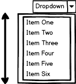

When building the frontend of a web application using React, it's sometimes difficult to determine how to organize React components. React's component API isn't opinionated in such a way that guides developers toward a "correct" way to scope component functionality. When adding functionality to an app, it's up to the developer to decide whether the new functionality is best implemented as a new component or as an addition to an existing component.

## What I Optimize For

The number one thing I optimize for when building applications is developer experience. Having built several React applications that are now used by end users in a production environment, I've found it's rare to require optimization at the component level (most of my application performance bottlenecks tend to pop up in the backend or API layer). Addressing bottlenecks when they surface is much easier for me when I have already focused on developer experience. Premature optimization based on speculation about what _might_ be slow often leads to a codebase that is less intuitive and harder to follow, and distracts from focus on the product.

My method of component scoping and organization helps to optimize for a codebase that is easier to follow and maintain. These components lend themselves fairly easily to reuse, often across different contexts.

## My approach

I use React components to encapsulate standalone units of functionality. A component is more than a reusable chunk of markup, it also contains any styles scoped to that markup as well as any behavior. Very little developer effort should be required to reuse a component in different parts of an app because of this.

My apps often have a mix of both class components and pure functional components. I prefer to initially implement a component as a pure functional component and then refactor to a class component once interactivity or internal state becomes required. I prefer implementing application state within a component when possible as this helps scope application state and makes it easier to understand which parts of the application depend on which parts of the application state. When reading through components later, it is immediately apparent whether a given component will involve internal state or handle interactivity (because it is implemented as a class component) or is used for display only (because it is implemented as a pure functional component).

It is important to be mindful of adding multiple functionalities to the same component. As applications mature and new capabilities are added, it can be easy to build new capabilities into existing components. Be careful with this! Over time, this causes component files to grow too large and be more difficult to reason about and maintain. Combining multiple functionalities into the same component also makes it more difficult to reuse the component. Instead, add the new functionality into a separate component and compose the functionalities as needed within a parent component.

To help keep track of scope creep in components, I try to think of it the same way I would a JavaScript function. A good practice when writing functions is to ensure the function only does one thing (and ideally has no side effects). If a function body starts doing multiple things, it's a good idea to break it apart into more granular functions that can be called separately and their results combined.

Applying the approach to a component has some differences from a regular function. A component with interactivity might contain more than one class function and any internal state means the component contains some side effects. Components apply both of these concepts differently. A component might include multiple class functions, but these should all involve a similar core concept. For example, a single component might have functionality to both open and close a modal, but adding functionality to this component to handle behavior of a form within the body of the modal would be overstepping the scope of the original component. A component could involve side effects in the form of changes to internal component state or more broadly to the application (I use [Redux](https://reduxjs.com), but it's uncommon for the same component to modify both internal state and application state.

I've found that when following this approach, pure functional components will be small, with files usually fewer than 80 lines of code (formatted with [Prettier](https://prettier.io/)). Class components with internal state and functionality will usually be around 100 lines of JavaScript, give or take about 25 lines.

## Example

For example, consider a Dropdown component: It contains a target that users can click to expand and show a list of clickable options in the menu.

Consider the more granular functionalities that make up this component:

- Handling a click to toggle the menu visibility
- Animating the collapse/expansion of the menu
- Displaying each option in the menu and handling its selction
- Containing the list of options
- Handling the functionality to close the menu when the user clicks elsewhere on the page
- Combining all of this functionality into a reusable component

